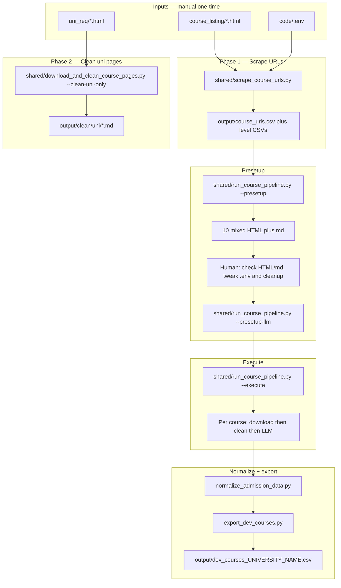
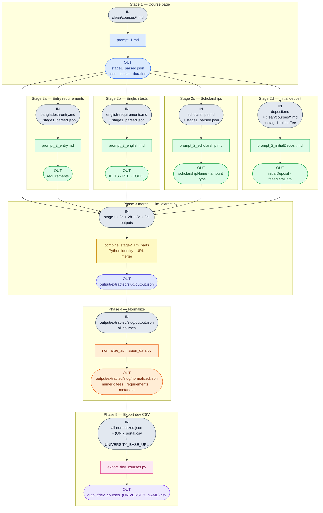

# F1 University Course Pipeline

Scrape course URLs (split by study level) → clean uni pages → **Presetup** (10 mixed courses) → review HTML/markdown/.env → Presetup LLM → **Execute** (download → clean → LLM per course) → normalize → export dev CSV.

**Working directory:** always `{University Name - SHORT}/code/` unless noted.

> **PowerShell:** `Set-Location "path"` — not `cd /d` (CMD only).  
> **Outputs:** all generated files live in `{University}/output/`, not `code/`.

Do **not** download every course HTML before you know cleanup and `.env` are right. Use Presetup, then Execute.

---

## Flow diagram (Mermaid)



---

## Full pipeline

1. **Scrape URLs** (writes `course_urls.csv` plus `foundation_course_urls.csv`, `undergraduate_course_urls.csv`, `postgraduate_course_urls.csv`, `postgraduate_research_course_urls.csv`)
2. **Clean uni pages** (`uni_req/` → `clean/uni/`)
3. **Presetup** — random **10** programs across available degree levels: download HTML + clean to markdown. **Stop.** Check HTML and `.md`, then edit `code/.env` and `code/course_markdown_cleanup.py`.
4. **Presetup LLM** — send those 10 markdown files to the LLM
5. **Execute** — pick study level(s) and **full** or **N** courses. For **each** URL: download HTML → clean → LLM (not all HTML first)
6. **Normalize + export** — runs once at the end of Execute

| Phase | Script | Input | Output |
|-------|--------|-------|--------|
| 1 | `shared/scrape_course_urls.py` | `course_listing/*.html` + `code/.env` | `output/course_urls.csv` + level CSVs |
| 2 | `shared/download_and_clean_course_pages.py --clean-uni-only` | `uni_req/*.html` | `output/clean/uni/*.md` |
| 3 | `shared/run_course_pipeline.py --presetup` | level CSVs | 10 HTML + `clean/pre_setup_course/{level}/*.md` + `presetup_sample.json` |
| 4 | `shared/run_course_pipeline.py --presetup-llm` | those 10 `.md` + `clean/uni/` | `output/extracted/pre_setup_course_extracted/{level}/{slug}/` |
| 5 | `shared/run_course_pipeline.py --execute --study-level foundation --all` | selected URLs | per-course HTML, md, LLM JSON; then `normalized.json` + `dev_courses_*.csv` |

Bulk `download_and_clean_course_pages.py` (all URLs) remains available on the CLI for power users. The dashboard default path is Presetup → Execute.

---

## Commands (full run)

Run from `{University}/code/` or pass `--code-dir` from the repo root:

```powershell
$UNI = "Anglia Ruskin University - ARU"

# 1 — discover all course URLs (split by study level)
python shared/scrape_course_urls.py --code-dir "$UNI/code"

# 2 — clean uni_req pages only
python shared/download_and_clean_course_pages.py --code-dir "$UNI/code" --clean-uni-only

# 3 — Presetup: 10 mixed-level courses, download + clean (no LLM)
python shared/run_course_pipeline.py --code-dir "$UNI/code" --presetup

# 3b — review output/course_pages/ and output/clean/pre_setup_course/{level}/
#      edit $UNI/code/.env and $UNI/code/course_markdown_cleanup.py

# 4 — Presetup LLM on those 10 markdown files
python shared/run_course_pipeline.py --code-dir "$UNI/code" --presetup-llm --resume

# 5 — Execute (example: all foundation, one course at a time)
python shared/run_course_pipeline.py --code-dir "$UNI/code" --execute --study-level foundation --all --resume

#     or a number of courses from one or more levels:
python shared/run_course_pipeline.py --code-dir "$UNI/code" --execute --study-level foundation undergraduate --limit 25 --resume
```

**Requires:** `pip install -r shared/requirements.txt`, `playwright install chromium`, Ollama running for Presetup LLM and Execute.

---

## What each phase does

**Phase 1** — Crawls listing pages (undergrad, postgrad, research, foundation per `.env`) and writes every course URL to `course_urls.csv`, split into per-level CSVs.

**Phase 2** — Cleans `uni_req/*.html` into `clean/uni/*.md` (Bangladesh entry, English, scholarships, deposit).

**Presetup** — Picks 10 unique programs spread across available degree levels, downloads those HTML pages, and cleans them. **Does not call the LLM.** You then inspect HTML + markdown and tune `.env` / `course_markdown_cleanup.py`.

**Presetup LLM** — Runs Stage 1 + 2a–2d on those 10 markdown files so you can check extraction quality.

**Execute** — For each selected URL (one study level or several; full catalogue or `--limit N`): download that HTML, clean it, then LLM-extract it. Normalize + export run once at the end.

**ARU example (cleanup):** strips Professional Experience dual-track sections and `### UK students` fee blocks.

**Phase 3** — Per course (see LLM flowchart below):

| Stage | Source | Extracts |
|-------|--------|----------|
| 1 parser | `clean/courses/*.md` (regex) | `tuitionFee`, `currency`, `intakeInfo`, `courseDuration`, page IELTS |
| 1 LLM | `clean/courses/*.md` + `prompt_1.md` | entry prose, `feesMetaData`, deadlines, deposit/app fee (grounded) |
| 2a | `clean/uni/bangladesh-entry.md` | entry requirements |
| 2b | `clean/uni/english-requirements.md` | IELTS / PTE / TOEFL |
| 2c | `clean/uni/scholarships.md` | scholarships |
| 2d | `clean/uni/deposit.md` + `clean/courses/*.md` | initial deposit |

### Field ownership (Stage 1)

| Field | Writer | Rule |
|-------|--------|------|
| `tuitionFee`, `currency` | Markdown parser | Parser value always wins. Empty if the page has no international fee. |
| `intakeInfo`, `courseDuration` | Markdown parser | Same. Python normalizes later (years → months, month names). |
| `ieltsMinOverall`, `ieltsMinSection` | Markdown parser | Only scores that match the course-page IELTS pattern. |
| `AcademicRequirementsMetaData` | LLM, then Python backfill | Empty LLM block is replaced from `## Entry requirements`. |
| `applicationFee`, `applicationDeadline`, `initialDeposit` | LLM | Kept only if the value (or its numbers/dates) appears in the course markdown. |
| `feesMetaData` | LLM + parser patch | Placeholder `example.com` / “find out more” lines stripped; parsed fee injected. |

The Stage 1 prompt must not contain realistic fee or date few-shots. Parsed values are injected as `{KNOWN_FIELDS}`. After extract, `parser_hints.json` and `extraction_warnings.json` sit beside `stage1_parsed.json`.

### LLM extract → normalize → export flowchart (Mermaid)

Per course through Phase 3; Phases 4–5 run batch over all extracted slugs.  
Each stage: **IN → script → OUT**.

**Colors:** grey = input · blue = Stage 1 · green = Stage 2 · yellow = merge · orange = normalize · pink = export · purple = final deliverable



| Stage | Prompt | Source | Extracts |
|-------|--------|--------|----------|
| **1** | `prompt_1.md` | course `.md` | fees, intake, duration |
| **2a** | `prompt_2_entry.md` | `bangladesh-entry.md` | entry requirements |
| **2b** | `prompt_2_english.md` | `english-requirements.md` | IELTS / PTE / TOEFL |
| **2c** | `prompt_2_scholarship.md` | `scholarships.md` | scholarships |
| **2d** | `prompt_2_initialDeposit.md` | `deposit.md` + course `.md` | initial deposit |

| Phase | Script | IN | OUT |
|-------|--------|----|-----|
| **3 merge** | `llm_extract.py` | stage1 + 2a–2d | `output/extracted/{slug}/output.json` |
| **4** | `normalize_admission_data.py` | `output.json` (all slugs) | `normalized.json` |
| **5** | `export_dev_courses.py` | `normalized.json` + portal CSV + `.env` | `dev_courses_{UNIVERSITY_NAME}.csv` + `dev_courses_{UNIVERSITY_NAME}_errors.csv` |

```powershell
python "..\..\shared\normalize_admission_data.py" .
python "..\..\shared\export_dev_courses.py" .
```

---

## Prerequisites (one-time setup)

| Item | Status for ARU |
|------|----------------|
| `code/.env` | Configured |
| `uni_req/*.html` | Saved |
| `output/clean/uni/` | Done |
| `course_listing/*.html` | Needed for Phase 1 |
| Ollama running locally | Needed for Phase 3 |

### `uni_req/` — fixed filenames

| File | Clean output | LLM stage |
|------|--------------|-----------|
| `bangladesh-entry.html` | `output/clean/uni/bangladesh-entry.md` | 2a |
| `english-requirements.html` | `output/clean/uni/english-requirements.md` | 2b |
| `scholarships.html` | `output/clean/uni/scholarships.md` | 2c |
| `deposit.html` | `output/clean/uni/deposit.md` | 2d |

```powershell
python download_and_clean_course_pages.py --clean-uni-only
```

---

## Test vs Execute

| | Presetup (10 mixed) | Execute `--limit 5` | Execute `--all` |
|--|---------------------|---------------------|-----------------|
| Courses | Stratified sample of 10 | First N of selected levels | All selected-level URLs |
| LLM | Separate `--presetup-llm` after review | Per course after each clean | Per course after each clean |
| Use when | Tuning `.env` / cleanup | Spot-check a level | Production export |

```powershell
python shared/run_course_pipeline.py --code-dir "$UNI/code" --presetup
python shared/run_course_pipeline.py --code-dir "$UNI/code" --presetup-llm --resume
python shared/run_course_pipeline.py --code-dir "$UNI/code" --execute --study-level foundation --limit 5 --resume
```

Power-user bulk (download all then clean — not the default):

```powershell
python shared/download_and_clean_course_pages.py --code-dir "$UNI/code" --limit 5
python shared/llm_extract.py "$UNI/code" --limit 5
```

---

## Optional / separate steps

| Step | Command / script | Purpose |
|------|------------------|---------|
| Refresh uni pages only | `python download_and_clean_course_pages.py --clean-uni-only` | Rebuild `clean/uni/` from `uni_req/` |
| Portal CSV split | `python shared/export_portal_courses.py` (repo root) | Master `UK Course.csv` → per-uni `_portal.csv` |
| Re-run Stage 2 only | `python "..\..\shared\llm_extract.py" . --skip-stage1` | Reuse cached `stage1_parsed.json` |
| Re-scrape URLs | `python "..\..\shared\scrape_course_urls.py" . --fresh` | Clear progress; re-extract all URLs |

---

## Short answer

A **full pipeline run** = scrape URLs → clean uni pages → Presetup 10 mixed courses → review `.env`/cleanup → Presetup LLM → Execute (per-course download/clean/LLM) → normalize → export dev CSV.

---

## University folder layout

```
{University Name - SHORT}/
  code/
    .env
    ENV.MD
    download_and_clean_course_pages.py
    course_markdown_cleanup.py
  uni_req/
  course_listing/
  course_detail/
  {UNIVERSITY_NAME}_portal.csv
  output/
```

| Item | Example |
|------|---------|
| Folder / `UNIVERSITY_NAME` | `Anglia Ruskin University - ARU` |
| `UNIVERSITY_BASE_URL` | `https://www.aru.ac.uk` |

---

## Phase reference (flags & outputs)

### Phase 1 — `shared/scrape_course_urls.py`

```powershell
python "..\..\shared\scrape_course_urls.py" .
python "..\..\shared\scrape_course_urls.py" . --fresh
python "..\..\shared\scrape_course_urls.py" . --append-urls
```

Also writes: `scrape_progress.json`, `scrape.log`, `failed_urls.csv` plus `foundation_course_urls.csv`, `undergraduate_course_urls.csv`, `postgraduate_course_urls.csv`, `postgraduate_research_course_urls.csv`.

---

## Presetup + Execute (recommended)

**Script:** `shared/run_course_pipeline.py`

```powershell
# 10 mixed-level courses: download HTML + clean (no LLM)
python shared/run_course_pipeline.py --code-dir "$UNI/code" --presetup

# After reviewing HTML/.md/.env/cleanup:
python shared/run_course_pipeline.py --code-dir "$UNI/code" --presetup-llm --resume

# Per-course download -> clean -> LLM, then normalize + export
python shared/run_course_pipeline.py --code-dir "$UNI/code" --execute --study-level foundation --all --resume
python shared/run_course_pipeline.py --code-dir "$UNI/code" --execute --study-level foundation undergraduate --limit 25 --resume
```

`output/presetup_sample.json` records the 10 URLs and RNG seed. `--fresh` on `--presetup` draws a new sample.

---

## Phase 2 — Download + clean (bulk / power user)

Run from `code/` (thin wrapper or direct):

```powershell
python download_and_clean_course_pages.py
python "../../shared/download_and_clean_course_pages.py" .
python download_and_clean_course_pages.py --download-only
python download_and_clean_course_pages.py --clean-only
python download_and_clean_course_pages.py --clean-uni-only
python download_and_clean_course_pages.py --clean-all
python download_and_clean_course_pages.py --limit 5
python download_and_clean_course_pages.py --fresh
python download_and_clean_course_pages.py --study-level foundation
python download_and_clean_course_pages.py --url "https://example.ac.uk/course"
```

Also writes: `output/clean_warnings.csv` — one row per missing clean block or empty extraction (check after `--clean-only` / `--clean-all`).

### Phase 3 — `shared/llm_extract.py`

```powershell
python "..\..\shared\llm_extract.py" .
python "..\..\shared\llm_extract.py" . --limit 5
python "..\..\shared\llm_extract.py" . --resume
python "..\..\shared\llm_extract.py" . --build-index
python "..\..\shared\llm_extract.py" . --md-file study-postgraduate-accounting-and-finance.md
python "..\..\shared\llm_extract.py" . --presetup --resume
python "..\..\shared\llm_extract.py" . --study-level foundation --resume
```

Prompts: `shared/prompt_1.md`, `prompt_2_entry.md`, `prompt_2_english.md`, `prompt_2_scholarship.md`, `prompt_2_initialDeposit.md`

### Phase 4 — `shared/normalize_admission_data.py`

```powershell
python "..\..\shared\normalize_admission_data.py" .
```

### Phase 5 — `shared/export_dev_courses.py`

Writes `dev_courses_{UNIVERSITY_NAME}.csv`, then validates it (importer column rules, Entry+English metadata, scholarship vs study level). University-specific `programmeName` comes from `{uniName}_portal.csv` during export. Any remaining empty `programmeName` is filled from the general `programmeName_dictionary.json` (`courseName` → `programmeName`). Leftovers are sent to Ollama, which must pick one of the unique programme names in that file. Dictionary hits get `COMMENT: programmeName inferred from dictionary (...)`; LLM hits get `COMMENT: programmeName inferred from dictionary by LLM (...)`. Use `--skip-llm-programme` to skip the Ollama step. Errors go to `dev_courses_{UNIVERSITY_NAME}_errors.csv`. Export still succeeds if rows fail validation.

Rebuild the dictionary only when `UK Course.csv` changes:

```powershell
python shared/programme_name_dictionary.py
```

```powershell
python "..\..\shared\export_dev_courses.py" .
python "..\..\shared\validate_dev_courses.py" .
```

---

## New university checklist

- [ ] Copy `_university_template` or `python shared/bootstrap_university.py "Name - SHORT"`
- [ ] Set `UNIVERSITY_NAME`, `UNIVERSITY_BASE_URL`, `STRATEGY` in `code/.env`
- [ ] Fill listing URLs, `COURSE_PATH_PATTERNS`, `COURSE_CLEAN_BLOCKS`
- [ ] Save 4 `uni_req/*.html` → run `--clean-uni-only`
- [ ] Save `course_listing/` per programme
- [ ] Save `course_detail/` samples
- [ ] Implement `code/course_markdown_cleanup.py` if needed
- [ ] Scrape URLs, Presetup 10 mixed courses, review HTML/md/.env, Presetup LLM
- [ ] Execute selected levels (full or N), then confirm `dev_courses_*.csv`

**Related docs:** `_university_template/README.md` · `shared/course_markdown_cleanup.md` · `scrape_course_urls_CMD.md` · [CONTRIBUTING.md](CONTRIBUTING.md)
