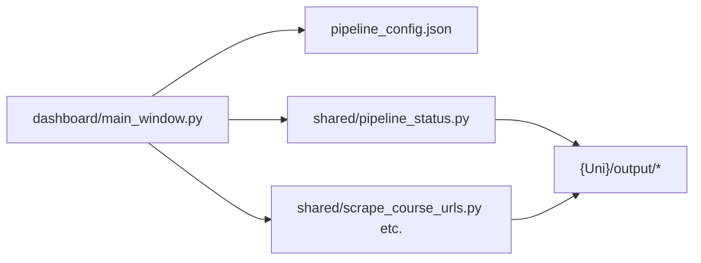

# University Data Pipeline Dashboard

Desktop UI for monitoring and running the university course pipeline. It reads progress from files on disk and launches the same **Python** scripts you would run from the repo root. No machine-specific paths. Works after `git clone` on any PC.

Repo root is always `dashboard/../` (from `Path(__file__)`), never a hardcoded `D:\` drive.

---

## What it does

| Feature | Description |
|---------|-------------|
| **Status table** | One row per university folder that has `code/ENV.MD` |
| **Phase buttons** | Scrape → uni clean → Presetup (10 mixed) → Presetup LLM → Execute |
| **Execute controls** | Study-level checkboxes + Full catalogue or Number |
| **Run modes** | Resume (default), Fresh, Append URLs (scrape only) |
| **Terminal pane** | Live stdout/stderr from the selected job |
| **Auto-refresh** | Table reloads every 5s while a job runs; manual **Refresh** anytime |

The dashboard does **not** embed pipeline logic. It is a thin UI over `shared/*.py` and `shared/pipeline_status.py`.

---

## Wiring overview

```
dashboard/START.bat  (or START.sh)
    └── python dashboard/main.py
            ├── loads dashboard/pipeline_config.json
            ├── shared/pipeline_status.py  → scan {University}/output/*
            └── TaskRunner → python -u shared/<phase>.py --code-dir "{Uni}/code"
```



---

## Prerequisites

1. **Python 3** on PATH (or the Windows `py` launcher).
2. **Pipeline deps** (once per machine), from the cloned repo root:

   ```powershell
   pip install -r shared/requirements.txt
   playwright install chromium
   ```

3. **Dashboard deps** — `START.bat` / `START.sh` auto-installs these if missing:

   ```powershell
   pip install -r dashboard/requirements.txt
   ```

   (`PySide6>=6.6.0`)

4. **Presetup LLM / Execute** — Ollama at `http://localhost:11434` (configurable in `pipeline_config.json`). The dashboard checks `/api/tags` before starting LLM.

---

## How to start

### Recommended

Double-click `dashboard/START.bat` (Windows) or run `dashboard/START.sh` (macOS/Linux).

### Manual

```powershell
Set-Location dashboard
python main.py
```

### Status without the UI

```powershell
python shared/pipeline_status.py
python shared/pipeline_status.py --json
```

---

## How universities appear in the table

Discovery is in `shared/pipeline_status.py`:

- Scan every **top-level folder** under the repo root.
- **Include** if `{Folder}/code/ENV.MD` exists.
- **Skip** `shared`, `dashboard`, `_university_template`, and dot-folders.

The **folder name** is passed as `--code-dir "{Folder}/code"` to the Python scripts. Keep folder names aligned with `RUN.md`.

---

## Status columns and source files

| Column | Meaning | Primary signals on disk |
|--------|---------|-------------------------|
| **Setup** | `uni_req/` HTML present | `bangladesh-entry.html`, `english-requirements.html`, `scholarships.html` |
| **URLs** | Phase 1 | `output/course_urls.csv`, `output/scrape_progress.json` (`phase=extracting_urls`) |
| **UniClean** | Phase 2 | `output/clean/uni/*.md`, `output/clean/manifest.json` |
| **Presetup** | 10 mixed-level sample | `output/presetup_sample.json` vs matching `clean/pre_setup_course` markdown |
| **Download** | Execute / remaining HTML | `scrape_progress.json` → `downloaded_urls`, `output/clean/courses/*.md`, `execute_selection.json` |
| **LLM** | Extraction | `output/extracted/extraction_progress.json` → `completed` / `failed` vs course MD count |
| **Norm** | Normalize | `output/extracted/*/output.json` vs `normalized.json` |
| **CSV** | Export | `output/dev_courses_{UNIVERSITY_NAME}.csv` (or any `dev_courses_*.csv`) |

Errors during URL scrape surface in the URLs column when `output/scrape.log` contains a recent `[ERROR]` or `[END] status=error`.

Cloudflare-sensitive folders are flagged in the UI (tooltip + label): University of South Wales, University of Wales Trinity Saint David, University of West London.

---

## Run modes and phase buttons

Set **Run mode** before clicking a phase button.

| Mode | Applies to | Effect |
|------|------------|--------|
| **Resume** | All phases (default) | Keep checkpoints; skip finished work |
| **Fresh** | Scrape, Presetup, Presetup LLM, Execute | Restarts that step (confirmation dialog). Presetup draws a new sample of 10. |
| **Append URLs** | Scrape only | Passes `--append-urls` |

| Button | Script | Extra args by mode |
|--------|--------|-------------------|
| **1 Scrape URLs** | `shared/scrape_course_urls.py` | Fresh → `--fresh`; Append → `--append-urls`; Resume → (none) |
| **2 Clean Uni Pages** | `shared/download_and_clean_course_pages.py` | Always `--clean-uni-only` |
| **3 Presetup (10 mixed)** | `shared/run_course_pipeline.py` | `--presetup`; Fresh → also `--fresh` |
| **4 Presetup LLM** | `shared/run_course_pipeline.py` | `--presetup-llm`; Resume → `--resume` |
| **5 Execute** | `shared/run_course_pipeline.py` | `--execute` + `--study-level` (checkboxes) + `--all` or `--limit N` |
| **Run remaining** | Same as above | Scrape → UniClean → Presetup, then stop for human review |

**Run remaining** does **not** auto-run LLM. After Presetup, review HTML and markdown, then click Presetup LLM. Then pick study levels and click Execute.

Button enablement (from `pipeline_status.py`):

- Uni clean: setup not `missing`
- Presetup: `course_urls.csv` has rows
- Presetup LLM: `presetup_sample.json` exists and at least one matching clean markdown
- Execute: URLs exist (you can force it without finishing Presetup LLM)

---

## Config wiring (`dashboard/pipeline_config.json`)

```json
{
  "ollama_host": "http://localhost:11434",
  "phases": [ ... ]
}
```

| Key | Purpose |
|-----|---------|
| `ollama_host` | Pre-flight check before Presetup LLM and Execute |
| `phases` | Documents phase IDs and Python scripts (UI uses `PHASES` in `main_window.py`) |

To point Ollama elsewhere, change `ollama_host`.

---

## New files (dashboard layer)

These were **added**; they do not replace existing pipeline scripts.

| Path | Role |
|------|------|
| `dashboard/main.py` | App entry; resolves repo root, loads config |
| `dashboard/app/ui/main_window.py` | Table, run modes, buttons, Ollama check |
| `dashboard/app/ui/terminal_widget.py` | Coloured log pane |
| `dashboard/app/core/task_runner.py` | Background `subprocess` + stream to UI |
| `dashboard/app/core/status_loader.py` | Imports `pipeline_status.scan_all_universities` |
| `dashboard/pipeline_config.json` | Ollama host + phase metadata |
| `dashboard/START.bat` / `START.sh` | Install PySide6 if needed, launch app |
| `dashboard/requirements.txt` | `PySide6>=6.6.0` |
| `shared/pipeline_status.py` | Disk scanner + CLI (`--json`) |
| `shared/run_llm_to_dev_csv.py` | Phases 3–5 (dashboard + CLI) |

Repo-root `run_*.ps1` files remain optional PowerShell wrappers. They use `$PSScriptRoot` (no hardcoded drives).

---

## Changes to existing code (alignment)

The dashboard was designed to sit **on top of** the pipeline without forking Python logic. Alignment work was mostly **wrappers, tracking files, and docs**.

### 1. Git tracking for resume/status files

So the dashboard (and git history) can see run state across machines:

| File | Change |
|------|--------|
| `output/scrape.log` | Stopped ignoring; committed per uni (commit `80a1f15`) |
| `output/scrape_progress.json` | Stopped ignoring; committed per uni |
| `output/extracted/extraction_progress.json` | **Removed** from `.gitignore` (commit `be6fe74`) so LLM column can reflect resume state in git |

No changes to `shared/scrape_course_urls.py`, `shared/download_and_clean_course_pages.py`, or `shared/llm_extract.py` were required for the dashboard — they already wrote these files.

### 2. Documentation cross-links

| File | Change |
|------|--------|
| `RUN.md` | Dashboard quick start, equivalent PowerShell one-liners, `pipeline_status.py` CLI |
| `PIPELINE.md` | Dashboard section at top; manual script examples |
| `scrape_course_urls_RUN.md` | Notes that `scrape.log` / `scrape_progress.json` are tracked |

### 3. `.gitignore` comments

Header comment now lists `extraction_progress.json` as recommended to commit (“LLM resume + dashboard Phase 3 status”).

### 4. What was **not** changed

These scripts behave the same whether you use the dashboard or the terminal:

- `shared/scrape_course_urls.py`
- `shared/download_and_clean_course_pages.py`
- `shared/llm_extract.py`
- `shared/normalize_admission_data.py`
- `shared/export_dev_courses.py`
- Per-university `code/.env` / `code/ENV.MD`

The dashboard only passes through flags the wrappers already supported (`--fresh`, `--append-urls`, `--clean-uni-only`, `-Resume`, etc.).

---

## Adding or wiring a new university

1. Copy `_university_template/` (or an existing uni folder).
2. Ensure `{New University Name}/code/ENV.MD` exists (required for discovery).
3. Save the three `uni_req/*.html` files for Setup = done.
4. Restart or click **Refresh** — the row appears automatically.
5. Run phases in order from the dashboard or matching `run_*.ps1` commands.

No dashboard code changes are needed unless you add custom phase scripts.

---

## Extending the dashboard

| Goal | Where to change |
|------|-----------------|
| New pipeline phase | Add `shared/*.py`, entry in `pipeline_config.json`, button + `PHASES` in `main_window.py`, detection in `pipeline_status.py` |
| New status column | `COLUMNS` + `detect_university_status()` in `pipeline_status.py`, table fill in `main_window.py` |
| Different Ollama URL | `pipeline_config.json` → optionally thread through `_start_command` for LLM |
| Exclude a folder from scan | Add to `SKIP_FOLDERS` in `pipeline_status.py` |

---

## Troubleshooting

| Symptom | Check |
|---------|--------|
| University missing from table | `{Name}/code/ENV.MD` must exist |
| LLM button blocked | Ollama not running, or no `output/clean/courses/*.md` |
| URLs column red / error | `{Uni}/output/scrape.log` — Cloudflare unis may need headed scrape |
| Status stale | Click **Refresh**; table auto-refreshes only during an active job |
| PySide6 install fails | `python -m pip install PySide6` from `dashboard/` |
| Script not found | Run `python main.py` from `dashboard/` inside a clone of this repo |

---

## Git checkout

```powershell
git checkout dev_sj
git pull origin dev_sj
```

Python phase scripts (called by the dashboard):

| Script | Phase |
|--------|-------|
| `shared/scrape_course_urls.py` | 1 — scrape URLs |
| `shared/download_and_clean_course_pages.py --clean-uni-only` | 2a — `uni_req` → `clean/uni` |
| `shared/download_and_clean_course_pages.py` | 2b — download + clean courses |
| `shared/run_llm_to_dev_csv.py` | 3–5 — LLM → normalize → dev CSV |

Repo-root `.ps1` wrappers still exist for PowerShell users; the dashboard does not require them.

Equivalent command references: [`scrape_course_urls_CMD.md`](scrape_course_urls_CMD.md), [`download_and_clean_course_pages_CMD.md`](download_and_clean_course_pages_CMD.md), [`run_llm_to_dev_csv_CMD.md`](run_llm_to_dev_csv_CMD.md).

---

## Related docs

- [`RUN.md`](RUN.md) — full command reference
- [`PIPELINE.md`](PIPELINE.md) — phase flow and artifacts
- [`dashboard/README.md`](dashboard/README.md) — short operator cheat sheet
