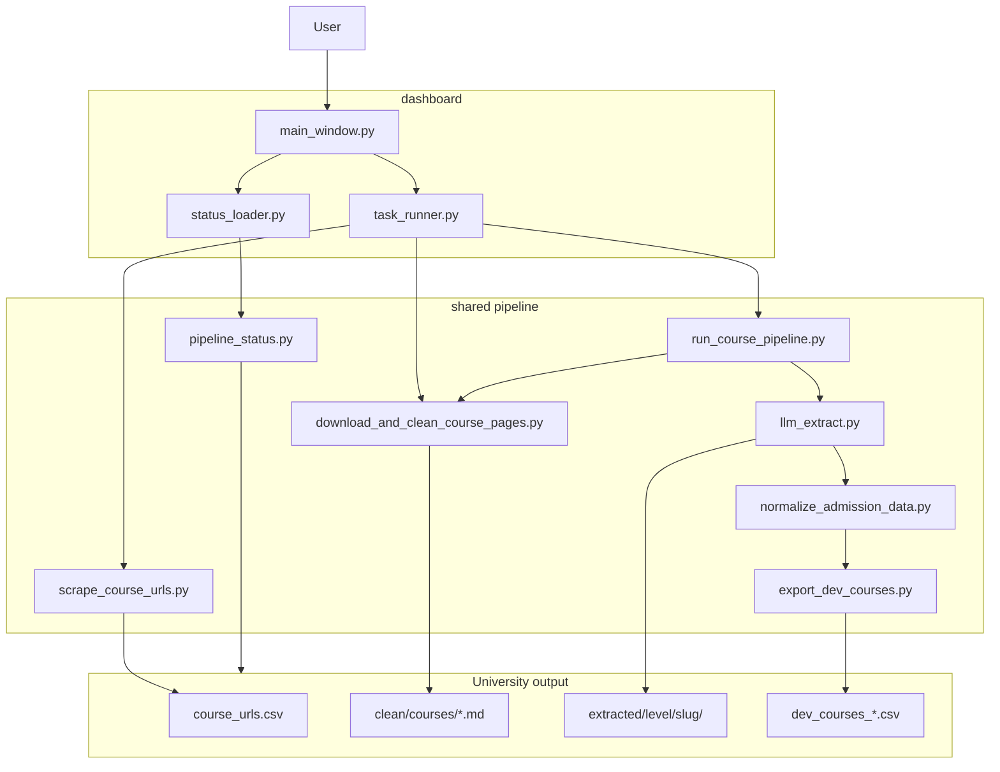

# Architecture

## System diagram



---

## Layer responsibilities

### Dashboard (`dashboard/`)

| File | Class | Responsibility |
|------|-------|----------------|
| `main.py` | — | Qt app entry, load config |
| `app/ui/main_window.py` | `MainWindow` | Table, phase buttons, study-level checkboxes |
| `app/core/task_runner.py` | `TaskRunner` | `QThread` subprocess with live stdout |
| `app/core/status_loader.py` | — | Thin wrapper around `pipeline_status` |
| `app/ui/terminal_widget.py` | `TerminalWidget` | Coloured log pane |

The dashboard **never** imports scrape/clean/LLM logic directly for execution — only for status scanning.

### Shared pipeline (`shared/`)

Organised by pipeline phase, not by “layers” like MVC:

| Phase | Primary module | Supporting modules |
|-------|----------------|-------------------|
| Paths / env | `uni_paths.py`, `build_env.py` | `portable_paths.py` |
| URL scrape | `scrape_course_urls.py` | `study_level.py`, `course_type_filter.py` |
| Download + clean | `download_and_clean_course_pages.py` | `engines/`, `clean_config.py`, `markdown_converter.py`, `course_markdown_cleanup.py` |
| Orchestration | `run_course_pipeline.py` | `study_level.py`, `uni_pages.py` |
| LLM extract | `llm_extract.py` | `ollama_client.py`, `prompt_*.md` |
| Normalize | `normalize_admission_data.py` | `programme_name_dictionary.py` |
| Export | `export_dev_courses.py` | — |
| Status | `pipeline_status.py` | — |
| Validation | `validate_uni_clean.py`, `validate_dev_courses.py` | — |
| Batch / utilities | `run_llm_to_dev_csv.py`, `run_all_download_clean.py` | — |

---

## Class-based modules (recent refactor)

Most large `shared/` modules use **classes + module-level aliases** for backward compatibility. Example pattern:

```python
class CourseUrlScraper:
    def run(self, ...): ...

# Back-compat
def run_scraper(...):
    return CourseUrlScraper(...).run(...)
```

**Why:** Easier to test and navigate large files (~2000+ lines) without breaking existing imports or CLI entry points.

Approximate class counts:

| Module | Classes |
|--------|---------|
| `scrape_course_urls.py` | 24 |
| `download_and_clean_course_pages.py` | 15 |
| `llm_extract.py` | 9 |
| `normalize_admission_data.py` | 9 |
| `pipeline_status.py` | 6 |
| `study_level.py` | 4 |

---

## Scrape strategies

`STRATEGY` in `.env` selects URL extraction mode:

| Strategy | When | Entry class |
|----------|------|-------------|
| `ALL_COURSE` | Saved A–Z catalogue HTML | `CatalogueUrlExtractor` |
| `DEGREE_SCOPED_PAGINATED` | Live paginated search per degree level | `PaginatedListingExtractor` |

Both funnel into `CourseUrlScraper`, which writes `course_urls.csv` and per-level CSVs.

---

## Clean engines

`COURSE_CLEAN_ENGINE` in `.env` dispatches HTML→markdown:

| Engine | Module |
|--------|--------|
| `generic` | `shared/engines/generic.py` |
| `utopian` | `shared/engines/utopian.py` |
| `plugin` | `{University}/code/course_html_builder.py` |

`CourseMarkdownBuilder` in `download_and_clean_course_pages.py` picks the engine.

---

## LLM extraction stages

`llm_extract.py` runs in two stages per course:

1. **Stage 1** — Parse markdown + promote structured fields (`Stage1MarkdownParser`, `Stage1Enricher`)
2. **Stage 2** — LLM calls for entry, English, scholarship, deposit (`Stage2Enricher`)

Output merges into `extracted/{level}/{slug}/output.json`.

---

## Progress and state

There is **no central database**. State lives in JSON/CSV under `{University}/output/`:

| File | Tracks |
|------|--------|
| `scrape_progress.json` | URL scrape + HTML download checkpoints |
| `extraction_progress.json` | LLM completed/failed slugs |
| `presetup_sample.json` | 10-course presetup selection |
| `execute_selection.json` | Execute run scope |

`pipeline_status.py` reads these files to colour the dashboard table.

---

## Extension points (per university)

| What | Where |
|------|-------|
| Listing URLs, path patterns | `code/.env` / `code/env/*.env` |
| HTML block selectors | `COURSE_CLEAN_BLOCKS` in `.env` |
| Post-MD section removal | `code/course_markdown_cleanup.py` (optional) |
| Custom HTML builder | `code/course_html_builder.py` (optional) |
| Saved listing HTML | `{University}/course_listing/` |

---

## See also

- Folder layout: [03-folder-structure.md](03-folder-structure.md)
- Artifacts: [04-data-flow.md](04-data-flow.md)
- Feature flows: [features/](features/)
