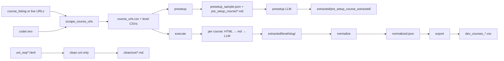

# Data flow

How data moves through the pipeline and which files appear on disk at each step.

---

## End-to-end flow



---

## Phase artifact table

| Phase | Script | Reads | Writes |
|-------|--------|-------|--------|
| 1 Scrape URLs | `scrape_course_urls.py` | `.env`, listing URLs/HTML | `course_urls.csv`, `*_course_urls.csv`, `scrape_progress.json`, `scrape.log` |
| 2 Uni clean | `download_and_clean_course_pages.py --clean-uni-only` | `uni_req/*.html` | `clean/uni/*.md`, `clean/manifest.json` |
| 3 Presetup | `run_course_pipeline.py --presetup` | level CSVs | 10× HTML, `clean/pre_setup_course/{level}/*.md`, `presetup_sample.json` |
| 4 Presetup LLM | `run_course_pipeline.py --presetup-llm` | presetup markdown + `clean/uni/` | `extracted/pre_setup_course_extracted/{level}/{slug}/` |
| 5 Execute | `run_course_pipeline.py --execute` | selected URLs | per-course HTML, `clean/courses/{level}/*.md`, `extracted/{level}/{slug}/`, then normalize + CSV |
| Normalize | `normalize_admission_data.py` | `output.json` | `normalized.json` |
| Export | `export_dev_courses.py` | `normalized.json` | `dev_courses_{UNIVERSITY}.csv` |

---

## Progress / checkpoint files

| File | Phase | Key fields |
|------|-------|------------|
| `scrape_progress.json` | URL scrape + download | `phase`, `listing_completed`, `group_state`, `downloaded_urls` |
| `extraction_progress.json` | LLM | `completed`, `failed` (slug keys) |
| `presetup_sample.json` | Presetup | `courses[]` with `url`, `study_level` |
| `execute_selection.json` | Execute | `study_levels`, `mode`, `limit`, `courses[]` |
| `clean/manifest.json` | Clean | course list metadata, `uni_pages` |

**Why JSON checkpoints:** Operators can kill a long run and resume; dashboard status reads the same files without a database.

---

## Study-level partitioning

URLs and outputs are split by study level:

| Level | URL CSV | Clean MD path | Extracted path |
|-------|---------|---------------|----------------|
| foundation | `foundation_course_urls.csv` | `clean/courses/foundation/` | `extracted/foundation/{slug}/` |
| undergraduate | `undergraduate_course_urls.csv` | `clean/courses/undergraduate/` | `extracted/undergraduate/{slug}/` |
| postgraduate | `postgraduate_course_urls.csv` | … | … |
| postgraduate_research | `postgraduate_research_course_urls.csv` | … | … |

Classification uses URL patterns from `.env` (`*_URL_PATTERNS`) via `study_level.py`.

---

## Per-course extraction folder

After LLM extract for slug `study-undergraduate-biology`:

```
output/extracted/foundation/study-undergraduate-biology/
├── output.json              # merged final record
├── stage1_parsed.json
├── stage2_parsed.json
├── stage2_llm_parsed.json
├── entry_requirement_*.json
├── english_requirements_*.json
├── scholarship_*.json
└── initial_deposit_*.json
```

Audit prompts/responses are kept for debugging failed extractions.

---

## Dashboard status mapping

The dashboard does not compute progress itself — `pipeline_status.py` infers columns from artifacts:

| Column | Primary signal |
|--------|----------------|
| Setup | `uni_req/` HTML files present |
| URLs | `course_urls.csv` + `scrape_progress.json` phase |
| UniClean | `clean/uni/*.md` |
| Presetup | `presetup_sample.json` vs `pre_setup_course` markdown count |
| Download | `downloaded_urls` vs `clean/courses` markdown |
| LLM | `extraction_progress.json` completed vs total |
| Norm | `normalized.json` exists per slug |
| CSV | `dev_courses_*.csv` exists |

See [dashboard.md](../dashboard.md) for full column definitions.

---

## See also

- [features/](features/) — step-by-step flows per phase
- [PIPELINE.md](../PIPELINE.md) — commands and examples
- [02-architecture.md](02-architecture.md)
